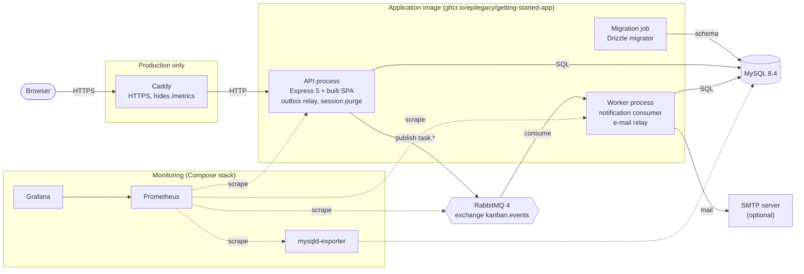
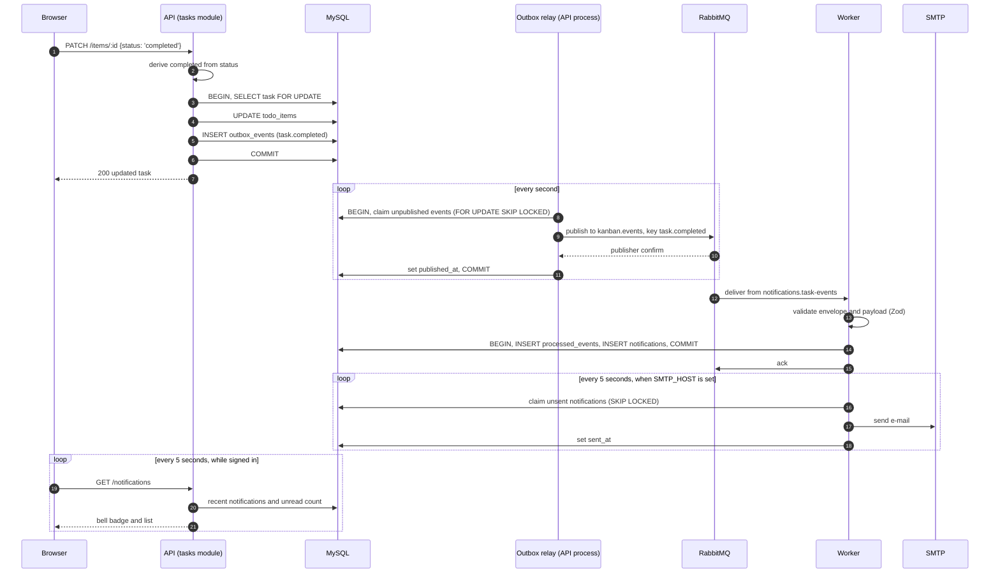
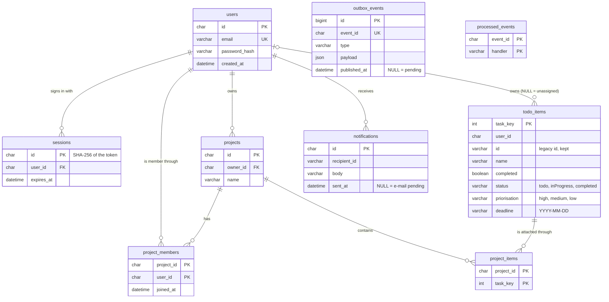
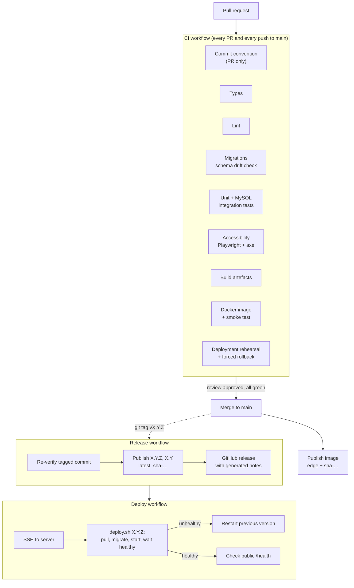

# Architecture

[Back to README](../README.md)

This document describes the final architecture of Legacy Kanban: what runs,
how the parts talk to each other, where data lives, and how a change travels
from a pull request to production. The reasoning behind each choice is in the
[architecture decision records](#architecture-decision-records); operational
details are in the [API reference](api.md), [deployment](deployment.md),
[release](release.md), [monitoring](monitoring.md) and
[accessibility](accessibility.md) guides.

- [From the legacy app to the final architecture](#from-the-legacy-app-to-the-final-architecture)
- [Architectural style](#architectural-style)
- [System overview](#system-overview)
- [Backend](#backend)
- [Frontend](#frontend)
- [Authentication and security](#authentication-and-security)
- [Event-driven workflow](#event-driven-workflow)
- [Data model](#data-model)
- [Projects and Kanban rules](#projects-and-kanban-rules)
- [Personal data and account deletion](#personal-data-and-account-deletion)
- [Observability](#observability)
- [Build, CI/CD and deployment](#build-cicd-and-deployment)
- [Quality and testing strategy](#quality-and-testing-strategy)
- [Architecture decision records](#architecture-decision-records)
- [Known limitations and next steps](#known-limitations-and-next-steps)

## From the legacy app to the final architecture

The starting point was Docker's getting-started todo app. The
[audit](../Audit%20translate.md) listed its debt; the table shows where each
item ended up.

| Concern | Legacy application | Final architecture |
| --- | --- | --- |
| Language | JavaScript, no types | TypeScript in strict mode, front and back, checked in CI and in the image build |
| Frontend | React loaded through `<script>` tags, JSX compiled in the browser, Bootstrap | React 18 SPA built by Vite, Material UI, React Router |
| Backend structure | Four route files calling persistence directly | Feature modules (auth, tasks, projects) with validation, services and repositories |
| Persistence | Two hand-written adapters (SQLite, MySQL), tables created at start-up, no primary key | MySQL 8.4 through Drizzle ORM, versioned SQL migrations run as a dedicated step |
| Users | None: one shared list | Accounts, server-side sessions, private tasks, shared projects |
| Coupling | Synchronous request path only | Transactional outbox, RabbitMQ and a separate notification worker |
| Quality | Jest tests not runnable as is | Typecheck, ESLint, coverage floor, MySQL integration tests, accessibility audit |
| Delivery | Manual | CI on every PR, image published from `main`, versioned releases from tags, automated deployment with rollback |
| Operations | No health check, no metrics | `/health`, Prometheus metrics, Grafana dashboard |

## Architectural style

Legacy Kanban is a **modular monolith with one asynchronous worker**.

- One API process serves the REST API and the built SPA. Code is split by
  business capability (`auth`, `tasks`, `projects`) rather than by technical
  layer, and each module owns its routes, rules and data access.
- One worker process consumes domain events from RabbitMQ. It is built from
  the same image and the same source tree, so producer and consumer share one
  event contract and cannot drift apart.
- One MySQL database holds all state. Modules write only their own tables;
  the worker writes only the notification tables.

This fits the problem and the team. The domain is small (users, projects,
tasks), a team of six had three sprints, and every feature needed real
transactions. Splitting it into microservices would have added network calls,
distributed data and several deployment units without solving a concrete
problem. Asynchronous messaging is used where it adds value: side effects such
as notifications and e-mails, which must never slow down or fail a user
request.

The boundaries are already in place for the next step. The event publisher is
an interface (port), the worker is already a separate process, and outbox
claiming uses `FOR UPDATE SKIP LOCKED`, so the relay can move to its own
process or run on several replicas without code changes.

## System overview



| Component | Technology | Responsibility | Port |
| --- | --- | --- | --- |
| API | Node 24, Express 5, TypeScript | REST API, SPA hosting, outbox relay, hourly session purge | 3000 |
| Worker | Node 24, amqplib | Consumes `task.*` events, stores notifications, sends e-mails | 9000 (metrics and health, internal) |
| Migration | drizzle-orm migrator | Applies `drizzle/` migrations before the API and worker start | — |
| MySQL | 8.4 | Single source of truth, including the outbox | 3306 |
| RabbitMQ | 4, quorum queues | Event transport, dead-lettering | 5672, 15692 (metrics) |
| Caddy | 2.10 | TLS termination and automatic certificates in production | 80, 443 |
| Prometheus, Grafana | 3.14, 13.2 | Metrics collection and the provisioned dashboard | 9090, 3001 (localhost only) |

The API listens only once its persistence, sessions and eventing are started,
so any answer on `/health` means start-up succeeded. Both processes stop
gracefully on `SIGTERM`.

## Backend

### Layout

| Location | Role |
| --- | --- |
| [`src/index.ts`](../src/index.ts) | API entry point: starts the database pools, the session purge and the outbox relay, then listens |
| [`src/app.ts`](../src/app.ts) | Express composition, shared by production and the HTTP tests; opens no connection itself |
| [`src/modules/auth`](../src/modules/auth) | Registration, login, sessions, attempt limits, profile, account deletion |
| [`src/modules/tasks`](../src/modules/tasks) | Task CRUD, claiming, Kanban status, emission of `task.completed` |
| [`src/modules/projects`](../src/modules/projects) | Projects, members, tasks attached to a project |
| [`src/modules/notifications`](../src/modules/notifications) | Lists the signed-in user's notifications and marks them read; never creates one |
| [`src/shared/events`](../src/shared/events) | Event envelope, event catalog (Zod schemas), publisher port |
| [`src/infrastructure`](../src/infrastructure) | Drizzle schema and pool, RabbitMQ adapter and topology, outbox repository and relay, mailer, HTTP metrics |
| [`src/workers/notifications`](../src/workers/notifications) | Worker entry point, message processing, idempotent handler, e-mail relay |
| [`src/scripts`](../src/scripts) | Runtime migrator used by deployments, SQLite to MySQL importer |
| [`drizzle/`](../drizzle) | Versioned SQL migrations and their journal |

### Layering

Each module follows the same dependency direction:

```text
routes.ts            HTTP: parses and validates input with Zod, maps results to status codes
  -> service.ts      business rules, returns typed results instead of throwing (auth, projects)
    -> types.ts      repository interface (port)
      <- repository.drizzle.ts   Drizzle implementation (adapter)
```

Services receive their repository and their clock or ID generator as
parameters, so the business rules are unit-tested with in-memory fakes and no
database. The tasks module is the exception: its rules are simple ownership
filters, so its routes call the repository directly, and the repository writes
the task and its outbox event in one transaction.

### Request pipeline

1. Metrics middleware records every request (`http_requests_total`,
   `http_request_duration_seconds`).
2. `GET /metrics` and `GET /health` answer without a session.
3. Static files from `dist/` (the Vite build).
4. `/auth`, `/items` and `/projects` routers. Protected routes go through
   `requireAuth`, which resolves the session cookie to a user. Task responses
   carry `Cache-Control: no-store`.
5. Any other HTML request receives `index.html`, so deep links work in the SPA.

Without `MYSQL_HOST`, the routers answer `503 auth_unavailable` instead of
starting in a half-working state. The full endpoint list is in the
[API reference](api.md).

## Frontend

| Location | Role |
| --- | --- |
| [`src/client/app`](../src/client/app) | Providers (theme, auth), layout with skip link and navigation, routes |
| [`src/client/pages`](../src/client/pages) | One component per route: home, Kanban (`/todos`), profile, login and register, accessibility statement, sitemap |
| [`src/client/features/auth`](../src/client/features/auth) | `AuthProvider` (current user), `RequireAuth` route guard, account deletion dialog |
| [`src/client/features/todos`](../src/client/features/todos) | API clients, `useTasks` hook, task and project forms, unassigned tasks list |
| [`src/client/features/notifications`](../src/client/features/notifications) | Notification bell in the header: unread badge, list, announcement of new ones |
| [`src/client/lib/http.ts`](../src/client/lib/http.ts) | `fetch` wrapper: JSON, credentials, `ApiError` with user-facing messages |

- **Same origin.** The SPA and the API share an origin (Express in production,
  the Vite proxy in development), so the session cookie works without CORS.
- **Routing.** `/login`, `/register`, `/accessibility` and `/sitemap` are
  public; `/`, `/todos` and `/profile` sit behind `RequireAuth`.
- **State.** Server state is fetched per page through small hooks such as
  `useTasks`; there is no global store, because no state is shared across
  pages beyond the current user.
- **UI.** Material UI components and a shared theme
  ([ADR 0002](adr/0002-adopt-material-ui.md)). Pages are audited against
  RGAA 4.1 / WCAG 2.1 AA ([accessibility guide](accessibility.md)).

## Authentication and security

- **Passwords** are hashed with scrypt from Node's crypto module
  (N = 2^17, r = 8, p = 1, 16-byte salt), OWASP's recommended minimum. An
  unknown e-mail still pays for one hash, so response time does not reveal
  which accounts exist.
- **Sessions** are server-side. The browser holds a random 32-byte token in an
  `HttpOnly`, `SameSite=Lax` cookie (`Secure` in production); the database
  stores only its SHA-256, so reading the `sessions` table does not let anyone
  sign in. Sessions last seven days and are purged hourly. Logging out or
  deleting the account revokes them immediately, which a stateless JWT could
  not do.
- **Brute force** is limited per account (5 logins per 15 minutes) and per IP
  (100 logins per 15 minutes, 50 registrations per hour).
- **Authorization** lives in the queries: every task and project query filters
  on the current user, so a client cannot reach another user's data by
  changing an ID. Unknown and foreign resources both answer `404` (tasks) or
  `409` (claims) without saying who owns them.
- **Input** is validated with Zod at every HTTP boundary and on every message
  the worker receives.
- **Deployment hygiene.** The image runs as the unprivileged `node` user,
  production credentials are mandatory (`:?` in Compose), only the proxy is
  exposed, and Caddy hides `/metrics` from the internet.

## Event-driven workflow

Completing a task, by moving its card to the Completed column, produces a
`task.completed` event. `status` is the source of truth and `completed`
always follows it ([`completion.ts`](../src/modules/tasks/completion.ts)),
so the board, the home screen and the event agree. The event is consumed
asynchronously to notify the user: the worker stores a notification, which
appears in the bell of the app's header within a few seconds, and sends an
e-mail when SMTP is configured.



### Guarantees

| Problem | How it is handled |
| --- | --- |
| Task saved but event lost, or event sent for a rolled-back update | **Transactional outbox**: the task update and the event row are committed in the same transaction |
| Two concurrent completions emitting twice | The task row is locked (`FOR UPDATE`) and the event is emitted only on the not completed → completed transition |
| Broker down or slow | Events wait in `outbox_events`; publishing uses publisher confirms and a 10 s timeout, and the batch is retried on the next tick |
| Duplicate delivery (at-least-once) | **Idempotent consumer**: `processed_events (event_id, handler)` is inserted in the same transaction as the notification, and a duplicate hits the primary key |
| Malformed message | Invalid JSON or an envelope that breaks the contract is rejected straight to the dead-letter queue |
| Handler keeps failing | Requeued; the quorum queue dead-letters it after 5 deliveries (`x-delivery-limit`) |
| Broker restart | Both sides reconnect (5 s maximum backoff) and redeclare the topology |
| Tracing one user action | A `correlationId`, from `X-Correlation-Id` or generated, travels from the HTTP request into the event envelope and the AMQP message properties |
| Several relays or e-mail relays running | Claims use `FOR UPDATE SKIP LOCKED`, so instances never process the same rows |

### Contract and topology

Every message carries the same envelope ([`envelope.ts`](../src/shared/events/envelope.ts)):
`eventId`, `type`, `version`, `occurredAt`, `correlationId`, `actorId`,
`aggregateId` and a `payload` whose schema is declared per type in the
[event catalog](../src/shared/events/catalog.ts). The API and the worker import
the same schemas, so a breaking payload change fails the build.

| RabbitMQ object | Type | Binding |
| --- | --- | --- |
| `kanban.events` | durable topic exchange | — |
| `notifications.task-events` | durable quorum queue, delivery limit 5 | `task.*` on `kanban.events` |
| `kanban.events.dlx` | durable topic exchange | dead-letter exchange of the queue above |
| `notifications.task-events.dlq` | durable queue | `#` on `kanban.events.dlx` |

To add an event: declare its payload schema and version in the catalog,
enqueue it with `createEvent` inside the transaction that changes the state,
and handle it in a consumer that records `processed_events`.

## Data model



- **Ownership.** Auth owns `users` and `sessions`; tasks owns `todo_items`;
  projects owns `projects`, `project_members` and `project_items`; the event
  infrastructure owns `outbox_events`; the worker owns `processed_events` and
  `notifications`.
- **Legacy rows** keep their original `id`. Migration `0002` added
  `task_key`, a generated primary key that identifies every row, including
  legacy duplicates and NULL IDs. Legacy tasks have no owner until a user
  claims them ([ADR 0003](adr/0003-claim-legacy-todos-after-authentication.md)).
- **Migrations.** The schema is declared in
  [`schema.ts`](../src/infrastructure/db/schema.ts). `npm run db:generate`
  produces reviewable SQL in `drizzle/`, and migrations run as their own
  Compose service, from the same image, before the API and worker start. The
  application never issues `CREATE TABLE`, and CI fails when `schema.ts`
  changes without its migration. See the
  [migration guide](../drizzle/README.md).

## Projects and Kanban rules

| Action | Who may do it |
| --- | --- |
| Create a project | Any signed-in user, who becomes its owner and first member |
| View a project and its tasks | Its members |
| Rename or delete a project, add a member by e-mail | The owner |
| Remove a member | The owner, or members leaving themselves; the owner cannot leave |
| Attach a task to a project | A member who owns the task; the assignee must also be a member |

Tasks move through three Kanban columns, `todo` → `inProgress` →
`completed`, stored in `todo_items.status`. A card moves by drag and drop
or with its "Status" select, the keyboard and touch alternative; both share
one code path, and each move is announced to screen readers.

Each task has a priority (`high`, `medium`, `low`) and an optional
deadline; the board searches by name and sorts by priority, and the home
screen lists the tasks due today.

## Personal data and account deletion

- Only what authentication needs is stored: an e-mail, a password hash and a
  creation date.
- `DELETE /auth/me` requires the current password and runs in one transaction:
  1. each owned project passes to its oldest remaining member, or is deleted
     if the user was alone;
  2. the user's personal tasks are deleted, while tasks attached to a
     project stay with that project;
  3. the user's notifications are deleted;
  4. the user is deleted, and sessions and memberships cascade.

## Observability

| Signal | Source |
| --- | --- |
| Liveness | `GET /health` on the API (Docker `HEALTHCHECK`), `GET /health` on worker port 9000 |
| HTTP traffic | `http_requests_total`, `http_request_duration_seconds` on the API's `/metrics` |
| Event processing | `notification_worker_messages_total` (applied, duplicate, ignored, rejected, failed), processing duration, in-flight messages, consumer state |
| Broker | RabbitMQ Prometheus plugin: queue depth, unacknowledged messages, consumers, DLQ |
| Database | `mysqld-exporter` with a dedicated read-only account |

Grafana provisions the `kanban-overview` dashboard automatically. See the
[monitoring guide](monitoring.md).

## Build, CI/CD and deployment

### Image

One multi-stage [Dockerfile](../Dockerfile) builds everything: a `deps` stage
installs dependencies, `build` typechecks, compiles the backend to `build/`
and bundles the frontend to `dist/`, and `runtime` ships only production
dependencies, the compiled code and the migrations, running as `node`. The
API, the worker and the migration job all run this one image with different
commands.

### Pipeline



- Superseded CI runs are cancelled, every job has a timeout, and dependency
  and Docker layer caches keep feedback fast.
- Jobs run in parallel; only `publish` waits for all of them, so an image on
  the registry always matches a commit the whole pipeline validated.
- The deployment rehearsal runs the real `deploy/deploy.sh` against the
  production Compose file on the runner, checks the app through the proxy,
  then deploys a broken image on purpose and asserts the rollback.
- Deploying an older version by hand (`workflow_dispatch`) is the rollback
  procedure. See the [release](release.md) and [deployment](deployment.md)
  guides.

### Production topology

[`deploy/compose.yml`](../deploy/compose.yml) runs published images only:
Caddy (the only exposed service), MySQL and RabbitMQ (internal, persistent
volumes), the one-shot migration, the API and the worker. The server keeps
its `.env`; the workflow copies only the Compose file, the Caddyfile and the
deploy script.

## Quality and testing strategy

| Level | Tooling | What it proves |
| --- | --- | --- |
| Static | `tsc --noEmit`, ESLint (recommended TypeScript rules), commitlint on commits and PR titles | Types, common defects, history convention |
| Schema | `db:check`, then `db:generate` must find nothing to write | The migration history is consistent and every schema change comes with its migration |
| Unit | Jest + ts-jest, supertest, in-memory fakes | Business rules, validation, HTTP mapping, worker logic; coverage floor enforced in `jest.config.cjs` |
| Integration | Jest against a disposable MySQL 8.4 | Migrations, repositories, outbox locking and relay, ownership rules |
| End-to-end | Playwright + axe-core | Every page conforms to WCAG 2.1 A/AA, keyboard navigation, 320 px reflow |
| Delivery | Docker smoke test, deployment rehearsal | The image starts and is healthy; deploying and rolling back work |

The [pull request template](../.github/pull_request_template.md) carries the
Definition of Done: an approval, unit tests, coverage, quality gate, green
CI, build artefacts, documentation and a demo at the Sprint Review.

## Architecture decision records

| Decision | Record |
| --- | --- |
| GitHub Actions for CI/CD | [ADR-001](adr/ADR-001_GitHub_Actions_EN.pdf) |
| Conventional Commits | [ADR-002](adr/ADR-002_Conventional_Commits_EN.pdf) |
| Keep Jest | [ADR-003](adr/ADR-003_Jest_EN.pdf) |
| Migrate to TypeScript | [ADR-004](adr/ADR-004_TypeScript_EN.pdf) |
| Component-based frontend built with Vite | [ADR-005](adr/ADR-005_VueJS_EN.pdf) |
| Drizzle ORM, MySQL 8.4 as the only engine | [ADR 0001](adr/0001-adopter-drizzle-orm.md) |
| Material UI | [ADR 0002](adr/0002-adopt-material-ui.md) |
| Legacy todos stay unassigned until claimed | [ADR 0003](adr/0003-claim-legacy-todos-after-authentication.md) |
| RabbitMQ with a transactional outbox | — |
| Server-side sessions and scrypt | — |
| Releases from tags, deployment over SSH with rollback | — |
| Prometheus and Grafana | — |

## Known limitations and next steps

- **Legacy adapters remain.** `src/persistence`, `src/routes`, the mysql2
  outbox relay and the native `sqlite3` dependency still exist behind
  `PERSISTENCE_DRIVER`. Production runs `drizzle`; removing the rest is step 5
  of [ADR 0001](adr/0001-adopter-drizzle-orm.md).
- **Completion is stored twice.** `completed` and `status` are separate
  columns. The application keeps them in step and migration `0005` aligned
  older rows, but a single column would remove the duplication.
- **Weak column types.** `deadline` and `priorisation` are `varchar(255)`;
  `DATE` and an enum would let the database enforce them.
- **Single API replica.** The attempt limiter is in memory and the outbox
  relay runs inside the API. Scaling out means moving the limiter to MySQL or
  Redis and the relay to its own process; claims are already safe for that.
- **Notifications are polled.** The bell asks for them every five seconds.
  Server-sent events would show them instantly, at the cost of a long-lived
  connection per open tab.
- **One event type.** Project events (member added, task assigned) and
  automatic project closure are the natural next consumers.
- **Monitoring** ships with the development Compose stack, not yet with
  `deploy/compose.yml`.
